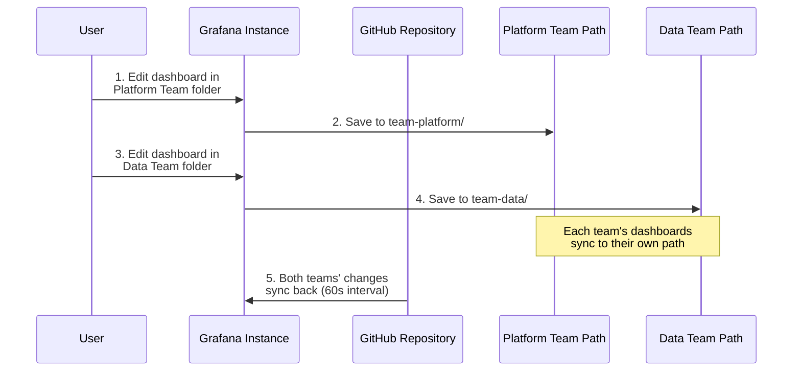

# Scenario 5: Multi-Team Setup

This scenario demonstrates how multiple teams can manage their own dashboards within a single Grafana instance, each syncing from their own repository path.

## Architecture

```mermaid
graph TB
    User[User] --> Grafana[Single Grafana Instance]

    subgraph GitHub[GitHub Repository]
        PlatformPath[team-platform/grafana/]
        DataPath[team-data/grafana/]
    end

    subgraph Grafana[Grafana Instance :3000]
        PlatformFolder[Platform Team Folder]
        DataFolder[Data Team Folder]
    end

    PlatformPath <--> |Git Sync Repo 1| PlatformFolder
    DataPath <--> |Git Sync Repo 2| DataFolder

    style Grafana fill:#f96332
    style GitHub fill:#333
```



## Sync Workflow



## Features

- **Single Instance**: One Grafana instance with multiple Git Sync repositories
- **Team Folders**: Each team's dashboards appear in their own folder
- **Flexible Configuration**: Teams can use:
  - Different repositories (e.g., `team-a/dashboards` vs `team-b/monitoring`)
  - Different paths in the same repository (e.g., `team-platform/` vs `team-data/`)
  - Different branches (e.g., `main` vs `team-data-prod`)
  - Any combination of the above
- **Shared Infrastructure**: All teams use the same Grafana instance

## Use Cases

1. **Platform Team**: Infrastructure monitoring, Kubernetes, CI/CD pipelines
2. **Data Team**: Data analytics, ETL jobs, data quality metrics

## Quick Start

```bash
# Start services
make start

# Configure Git Sync for both teams
make setup-git-sync

# Open Grafana
make open
```

## Team Structure

### Platform Team
- **Folder**: Platform Team
- **Git Path**: `5-multi-team/team-platform/grafana/`
- **Focus**: Infrastructure and platform services

### Data Team
- **Folder**: Data Team
- **Git Path**: `5-multi-team/team-data/grafana/`
- **Focus**: Data pipelines and analytics

## Workflow

1. Two Git Sync repositories are configured in the same Grafana instance
2. **Platform Team** dashboards sync to "Platform Team" folder
3. **Data Team** dashboards sync to "Data Team" folder
4. Each team's changes are synced to their respective Git directory
5. Teams can work independently using separate folders

## Configuration Flexibility

This scenario shows teams using the same repository with different paths, but you can configure each team to use:

- **Different Repositories**: Each team can have their own repository
  ```yaml
  # Platform Team
  github:
    url: https://github.com/company/platform-dashboards

  # Data Team
  github:
    url: https://github.com/company/data-dashboards
  ```

- **Different Branches**: Teams can use different branches in the same repository
  ```yaml
  # Platform Team
  github:
    url: https://github.com/company/dashboards
    branch: main

  # Data Team
  github:
    url: https://github.com/company/dashboards
    branch: data-team
  ```

- **Different Paths**: Teams can use different paths (as shown in this scenario)
  ```yaml
  # Platform Team
  github:
    path: 5-multi-team/team-platform/grafana

  # Data Team
  github:
    path: 5-multi-team/team-data/grafana
  ```

- **Any Combination**: Mix and match based on your team's needs

## Available Commands

```bash
make start           # Start all services
make setup-git-sync  # Configure Git Sync for both teams
make stop            # Stop all services
make restart         # Restart all services
make logs            # View all logs
make logs-grafana    # View Grafana logs
make open            # Open Grafana
make open-all        # Open Grafana + ngrok dashboard
make health          # Check service health
make clean           # Clean up everything
```

## Benefits

- **Resource Efficiency**: Single Grafana instance for multiple teams
- **Simple Setup**: No need for multiple instances
- **Team Autonomy**: Each team manages their own folder
- **Version Control**: All dashboards tracked in Git
- **Collaboration**: Teams share the same instance and can cross-reference
- **Easy to Add Teams**: Just add another Git Sync repository configuration
