# Scenario 1: Default Setup

Single Grafana instance with Git Sync.

## Architecture

```mermaid
graph LR
    User[User] --> Grafana[Grafana Instance]
    Grafana <--> |Git Sync| GitHub[GitHub Repository]
    Grafana --> Renderer[Image Renderer]

    style Grafana fill:#f96332
    style GitHub fill:#333
```



## What's Included

- Single Grafana instance with ngrok tunnel
- Demo dashboards in applications/ folder
- Image rendering for PR previews

## Quick Start

```bash
# From repository root - configure .env once
cp .env.example .env
# Edit .env with your ngrok token

# Start this scenario
cd scenario-1-default
make start

# Get public URL
make ngrok-url

# Open in browser
make open
```

Login: `admin` / `admin`

## Configure Git Sync

**Path for this scenario**: `scenario-1-default/grafana/`

See [main README](../README.md#quick-start) for full Git Sync setup instructions.

## Try It Out

Once Git Sync is configured, try these features:

- [ ] **View synced dashboards** - Check that existing dashboards appear in Grafana UI
- [ ] **Create dashboard in UI** - Create a new dashboard and save directly to `main` branch
- [ ] **Use branch workflow** - Create a dashboard, choose "Create new branch", and open a pull request
- [ ] **Edit in Git** - Modify a dashboard JSON file in GitHub and watch it sync to Grafana (60s interval)
- [ ] **Force manual sync** - Use the Pull button in Administration → Provisioning to sync immediately
- [ ] **Check sync status** - View Git Sync status and history in Administration → Provisioning
- [ ] **Test PR previews** - Create a PR with dashboard changes and view rendered preview images

## Makefile Commands

```bash
make start         # Start services
make open          # Open Grafana
make ngrok-url     # Get public URL
make logs          # View logs
make stop          # Stop services
```

See [main README](../README.md#makefile-commands) for all commands.

## Troubleshooting

See [main README troubleshooting section](../README.md#troubleshooting).
