# Scenario 2: Dev/Prod Setup

Demonstrate promoting a dashboard from development to production using Git Sync.

## Architecture


## Promotion Workflow



```mermaid
sequenceDiagram
    participant User
    participant Dev as Dev Grafana
    participant Git as GitHub Repository
    participant Prod as Prod Grafana

    User->>Dev: 1. Edit dashboard
    Dev->>Git: 2. Save to dev/ folder
    User->>Git: 3. Copy dashboard<br/>dev/ → prod/
    User->>Git: 4. Commit & Push
    Git->>Prod: 5. Git Sync (60s)
    Prod->>User: 6. Dashboard available
```

## What's Included

- Two instances: Dev and Prod
- Both have applications/ folder with demo dashboards
- Dev has additional `new-dashboard.json` for promotion demo
- Ngrok tunnel points to Prod (for Git Sync webhooks)

## Quick Start

```bash
# From repository root - configure .env once
cp .env.example .env
# Edit .env with your ngrok token

# Start this scenario
cd scenario-2-dev-prod
make start

# Open both instances
make open-all
```

**Access**:
- Dev: http://localhost:3000 (local only)
- Prod: http://localhost:3001 or ngrok URL

Login: `admin` / `admin`

## Configure Git Sync

### Dev Instance (http://localhost:3000)

**Path**: `scenario-2-dev-prod/dev/`

### Prod Instance (http://localhost:3001 or ngrok URL)

**Path**: `scenario-2-dev-prod/prod/`

See [main README](../README.md#quick-start) for full Git Sync setup instructions.

## Configuration Flexibility

This scenario shows dev and prod using the same repository with different paths, but you can configure them to use:

- **Different Repositories**: Separate repos for dev and prod environments
  ```yaml
  # Dev
  github:
    url: https://github.com/company/dashboards-dev

  # Prod
  github:
    url: https://github.com/company/dashboards-prod
  ```

- **Different Branches**: Different branches in the same repository
  ```yaml
  # Dev
  github:
    url: https://github.com/company/dashboards
    branch: develop

  # Prod
  github:
    url: https://github.com/company/dashboards
    branch: main
  ```

- **Different Paths**: Different paths in the same repository (as shown in this scenario)
  ```yaml
  # Dev
  github:
    path: scenario-2-dev-prod/dev

  # Prod
  github:
    path: scenario-2-dev-prod/prod
  ```

- **Any Combination**: Mix and match based on your workflow needs

## Promotion Workflow

### 1. Edit in Dev

Open http://localhost:3000 and edit `new-dashboard.json`

### 2. Promote to Prod

```bash
make promote
```

This copies `dev/new-dashboard.json` to `prod/promoted-from-dev.json`

### 3. Commit and Push

```bash
git add prod/promoted-from-dev.json
git commit -m "Promote dashboard to prod"
git push
```

### 4. Verify in Prod

Wait 60s for Git Sync or force sync in Prod UI. Then open Prod:

```bash
make open-prod
```

## Makefile Commands

```bash
make start         # Start both dev and prod
make open-dev      # Open dev Grafana
make open-prod     # Open prod Grafana
make open-all      # Open both + ngrok dashboard
make promote       # Promote dev dashboard to prod
make logs-dev      # View dev logs
make logs-prod     # View prod logs
```

See [main README](../README.md#makefile-commands) for all commands.

## Troubleshooting

See [main README troubleshooting section](../README.md#troubleshooting).
