# Scenario 3: Primary/Mirror Setup

Two Grafana instances syncing from the same Git directory for disaster recovery and high availability.

## Architecture

```mermaid
graph TB
    User[User] --> Ngrok[Ngrok Tunnel]
    Ngrok --> |Failover Switch| Primary[Primary Grafana<br/>localhost:3000]
    Ngrok -.-> |Can switch to| Mirror[Mirror Grafana<br/>localhost:3001]

    Primary <--> |Git Sync<br/>grafana/<br/>Bidirectional| GitHub[GitHub Repository]
    Mirror <--> |Git Sync<br/>grafana/<br/>Read-Only| GitHub

    Primary -.-> |Automatic Sync| Mirror

    style Primary fill:#f96332
    style Mirror fill:#ffa500
    style GitHub fill:#333
    style Ngrok fill:#1f8fff
```



## What's Included

- Two instances: Primary and Mirror
- Both sync from same directory: `grafana/`
- Demo dashboards in applications/ folder
- Ngrok tunnel points to Primary

## Quick Start

```bash
# From repository root - configure .env once
cp .env.example .env
# Edit .env with your ngrok token

# Start this scenario
cd scenario-3-mirror
make start

# Open both instances
make open-all
```

**Access**:
- Primary: http://localhost:3000 or ngrok URL
- Mirror: http://localhost:3001 (local only)

Login: `admin` / `admin`

## Configure Git Sync

### Primary Instance (http://localhost:3000 or ngrok URL)

- **Path**: `scenario-3-mirror/grafana/`
- **Sync Mode**: Bidirectional (can push changes)

### Mirror Instance (http://localhost:3001)

- **Path**: `scenario-3-mirror/grafana/` (same as primary)
- **Sync Mode**: Read-Only (recommended)

See [main README](../README.md#quick-start) for full Git Sync setup instructions.

## How It Works

Both instances sync from the same Git directory, staying identical:
- Primary pushes changes to Git
- Mirror pulls changes from Git
- Automatic synchronization every 60s

## Failover

To switch ngrok tunnel to mirror:

1. Edit `docker-compose.yml`
2. Change ngrok command from `grafana-primary:3000` to `grafana-mirror:3000`
3. Restart ngrok: `make restart-ngrok`

Or use: `make failover` for instructions.

## Makefile Commands

```bash
make start           # Start both primary and mirror
make open-primary    # Open primary Grafana
make open-mirror     # Open mirror Grafana
make open-all        # Open both + ngrok dashboard
make failover        # Show failover instructions
make logs-primary    # View primary logs
make logs-mirror     # View mirror logs
```

See [main README](../README.md#makefile-commands) for all commands.

## Troubleshooting

See [main README troubleshooting section](../README.md#troubleshooting).
