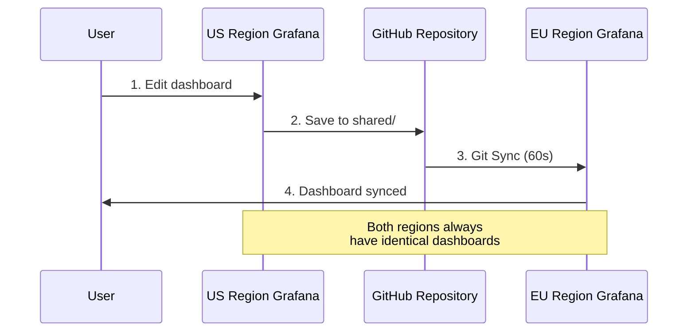

# Scenario 3: Multi-Region Deployment

Demonstrate multiple Grafana instances in different regions syncing from the same Git directory.

## Architecture

```mermaid
graph TB
    User[User] --> US[US Region Grafana]
    User --> EU[EU Region Grafana]

    subgraph GitHub[GitHub Repository]
        SharedFolder[shared/]
    end

    US <--> |Git Sync| SharedFolder
    EU <--> |Git Sync| SharedFolder

    style US fill:#4285f4
    style EU fill:#34a853
    style GitHub fill:#333
```



## Sync Workflow



## What's Included

- Two Grafana instances representing different regions
- Both sync from the same shared/ directory
- Demonstrates identical dashboards across multiple deployments
- Ngrok tunnel points to EU region

## Quick Start

```bash
# From repository root - configure .env once
cp .env.example .env
# Edit .env with your ngrok token

# Start this scenario
cd scenario-3-multi-region
make start

# Open both instances
make open-all
```

**Access**:
- US Region: http://localhost:3000
- EU Region: http://localhost:3001 or ngrok URL

Login: `admin` / `admin`

## Configure Git Sync

### Both Instances

**Path**: `scenario-3-multi-region/shared/`

Both US and EU instances should be configured with the same path to ensure they sync identical dashboards.

See [main README](../README.md#quick-start) for full Git Sync setup instructions.

## Use Case

This scenario demonstrates:

1. **Consistent dashboards across regions** - All instances have identical dashboards
2. **Centralized dashboard management** - Update once, deploy everywhere
3. **Multi-region deployment** - Same configuration in different geographic locations

### Workflow

1. Edit dashboard in either US or EU instance
2. Commit to Git (directly or via PR)
3. Both instances sync the same changes (60s interval)
4. Verify identical dashboards across all regions

## Makefile Commands

```bash
make start         # Start both US and EU instances
make open-us       # Open US region Grafana
make open-eu       # Open EU region Grafana
make open-all      # Open both + ngrok dashboard
make logs-us       # View US region logs
make logs-eu       # View EU region logs
```

See [main README](../README.md#makefile-commands) for all commands.

## Troubleshooting

See [main README troubleshooting section](../README.md#troubleshooting).
