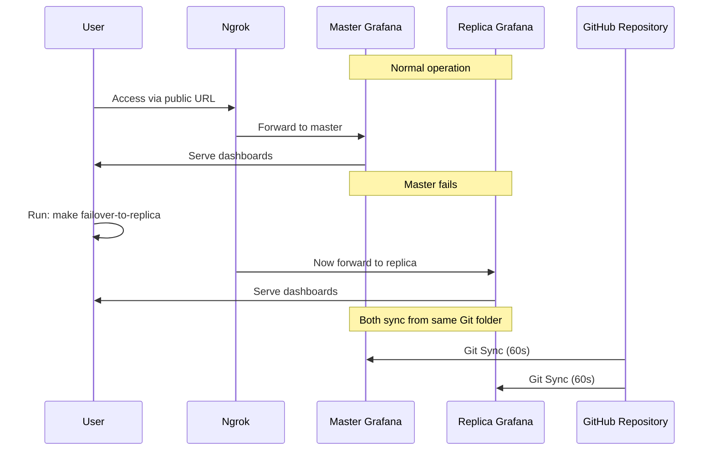

# Scenario 4: Master-Replica with Load Balancer

Demonstrate high availability setup with master-replica Grafana instances behind a load balancer.

## Architecture

```mermaid
graph TB
    User[User] --> LB[Nginx Load Balancer]
    LB --> Master[Master Grafana]
    LB --> Replica[Replica Grafana]

    subgraph GitHub[GitHub Repository]
        SharedFolder[shared/]
    end

    Master <--> |Git Sync| SharedFolder
    Replica <--> |Git Sync| SharedFolder

    style Master fill:#f96332
    style Replica fill:#ffa500
    style LB fill:#4285f4
    style GitHub fill:#333
```



## Failover Workflow



## What's Included

- Two Grafana instances (master and replica)
- Nginx load balancer with automatic failover
- Both instances sync from the same shared/ directory
- Easy failover commands via Makefile

## Quick Start

```bash
# From repository root - configure .env once
cp .env.example .env
# Edit .env with your ngrok token

# Start this scenario
cd scenario-4-master-replica
make start

# Open all interfaces
make open-all
```

**Access**:
- Master: http://localhost:3000
- Replica: http://localhost:3001
- Load Balancer: http://localhost:8080
- Ngrok URL: Run `make ngrok-url`

Login: `admin` / `admin`

## Configure Git Sync

### Both Master and Replica

**Path**: `scenario-4-master-replica/shared/`

Both master and replica instances should be configured with the same path to ensure they sync identical dashboards.

See [main README](../README.md#quick-start) for full Git Sync setup instructions.

## Use Case

This scenario demonstrates:

1. **High availability** - Multiple instances for redundancy
2. **Load balancing** - Traffic distributed across instances
3. **Easy failover** - Simple commands to switch between instances
4. **Consistent dashboards** - All instances sync from the same Git directory

## Failover Commands

### Failover to Replica

```bash
make failover-to-replica
```

This redirects ngrok traffic from master to replica.

### Failover to Master

```bash
make failover-to-master
```

This redirects ngrok traffic back to master.

### Check Current Status

```bash
make health          # Check health of all services
make ngrok-url       # Get current public URL
```

## Testing Failover

1. Start services: `make start`
2. Configure Git Sync on both instances
3. Create a dashboard in master
4. Verify it syncs to replica (60s wait)
5. Run `make failover-to-replica`
6. Access ngrok URL - now served by replica
7. Run `make failover-to-master` to switch back

## Makefile Commands

```bash
make start                  # Start all services
make open-master            # Open master Grafana
make open-replica           # Open replica Grafana
make open-lb                # Open load balancer
make open-all               # Open all interfaces
make failover-to-replica    # Failover ngrok to replica
make failover-to-master     # Failover ngrok to master
make logs-master            # View master logs
make logs-replica           # View replica logs
make health                 # Check service health
```

See [main README](../README.md#makefile-commands) for all commands.

## Troubleshooting

### Load Balancer Not Working

```bash
make logs-lb        # Check nginx logs
make health         # Verify all services are healthy
```

### Failover Not Working

1. Check both instances are running: `make status`
2. Verify both instances are healthy: `make health`
3. Check ngrok is pointing to correct instance: `docker-compose logs ngrok`

See [main README troubleshooting section](../README.md#troubleshooting) for more help.
